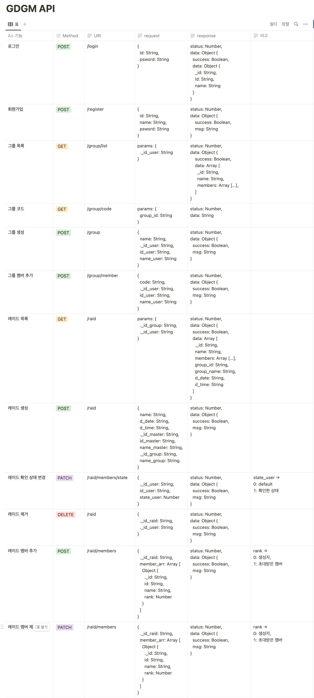

GDGM - ver.2
====

|||
|-|-|
|진행기간|7월18일 ~ 8월4일|
|리뉴얼기간|11월1일 ~ 12월11일|
|서비스목표|게임에서 그룹의 일정이 잘 지켜지지 않는 모습을 보며 이런 기능이 있으면 좋겠다 생각한 기능을 포함한 앱을 만들고 싶었다.|
|필수기능|회원기능, 큰 그룹(공격대), 작은 그룹(레이드), 작은 그룹에서의 일정 관리|
|리뉴얼이유|Node.js와 React를 배우자마자 썼다보니 폴더구조 등 객체지향적으로 쓰지 못한거 같아 다시 만들게 되었다.|

# 사용된 외부 모듈
||모듈이름|
|-|-|
|Node.js|express cors dotenv path winston bcrypt mongodb mongoose|
|React|react-router-dom axios @reduxjs/toolkit react-redux redux-persist|

# 사용 안내
## 1. 공격대 생성
</img>
## 2. 레이드 생성
</img>
## 3. 멤버 확인 및 초대코드 복사
</img>
## 4. 초대코드 입력
</img>
## 5. 레이드 멤버 추가
</img>
## 6. 레이드 멤버 추방
</img>
## 7. 상태 변경
</img>
## 8. 레이드 삭제
</img>

# API 명세서
</img>
 
# 앞으로 추가되야할 기능 (12월11일 기준)
- 로그인 시스템 변경
- 서버 배포
- 테스트 작성
- localStorage를 통한 클라이언트쪽에서의 세션 유지가 아닌 passport 등을 통한 서버쪽에서의 세션 유지
- 공격대, 레이드별 중복 이름에 대한 실 사용자 의견 검토
- 위 의견을 받기 위한 리포트 기능 -> 관리자 권한을 통해 해당 사이트에서 확인을 할지 이메일이나 구글 스프레드시트로 받을지 고민해봐야할듯